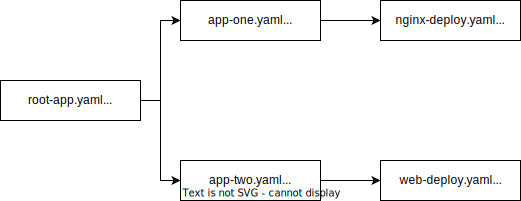

# Use App-of-apps pattern with ArgoCD

## 1. Pre-requisites

1. Kubernetes cluster
2. Login into the kubernetes cluster
3. clone this repository

## 2. Deploy ArgoCD

Get into argocd directory and deploy argocd into kubernetes cluster using 'argocd-install.yaml'

```
cd argocd
kubectl create -f argocd-install.yaml
```

## 3. Create an Ingress object to access ArgoCD (optional)

If you have an nginx ingress controller deployed, create the necessary ingress object as mentioned below.

```
kubectl create -f argo-ingress.yaml
```

## 4. Create the root / parent ArgoCD 'Application'

The root application points to a directory (it could be another repo also) consisting of other 'Applications'.





Deploy the root 'Application':

```
kubectl create -f root-app.yaml
```

## 5. Access the root Application from ArgoCD Console and Sync

Go to ArgoCD console and you should see the root-app there. Click on 'Sync' and you should see the 'app-one' and 'app-two' Applications. You can 'Sync' the individual apps for the final deployements to get loaded into the Cluster.

You can add more 'Applications' into the 'apps' folder to see them picked-up by ArgoCD automatically. This would be helpful if you have an app with a bunch of micro-services and the number of micro-services keep increasing over a period of time. All we need to do is add hte new micro-service to the list of 'Applications'. 
